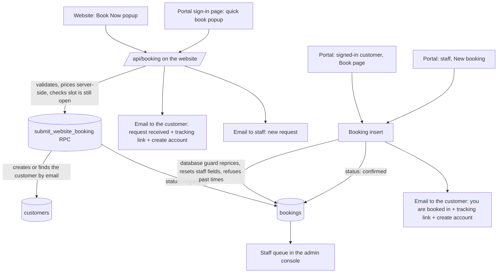
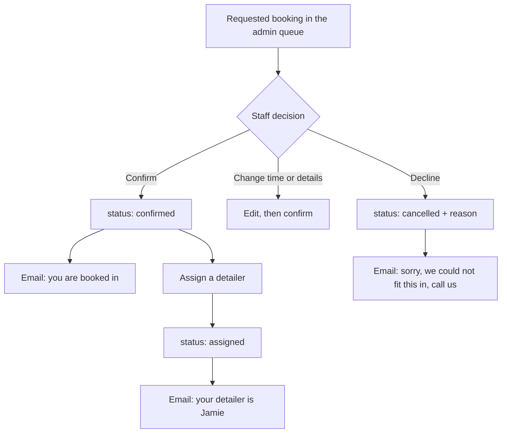
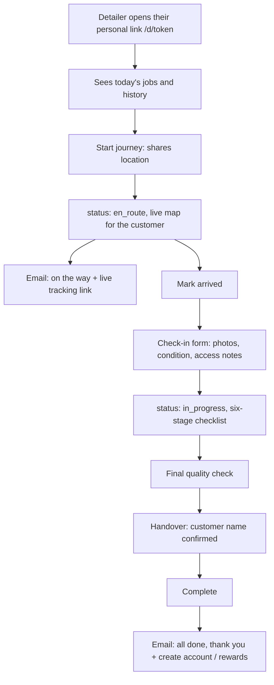
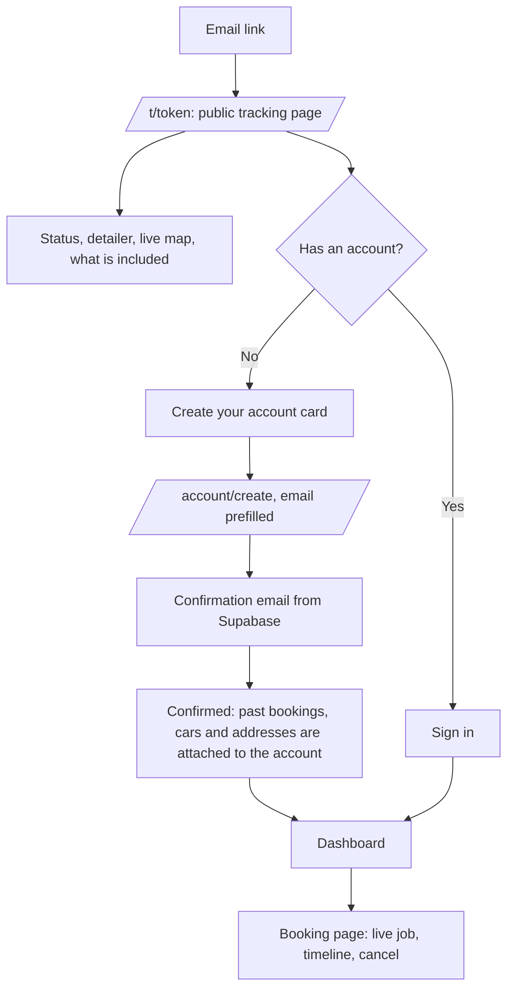
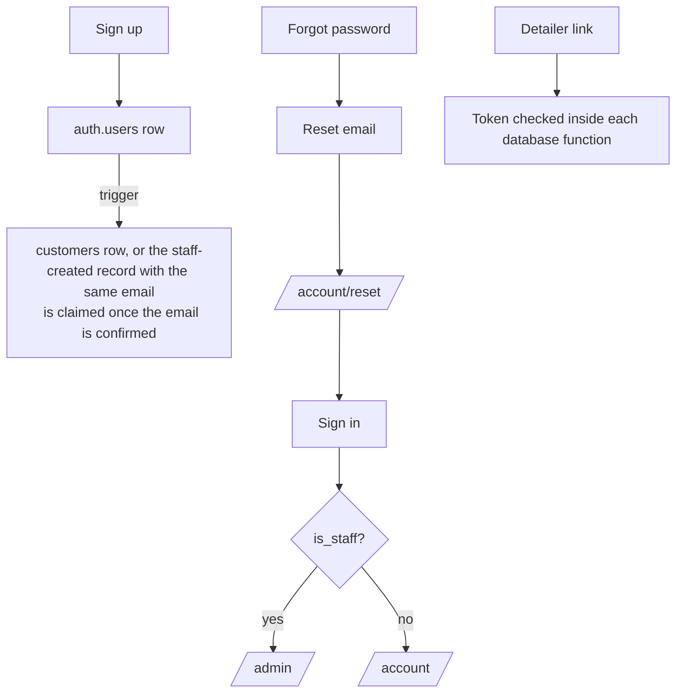
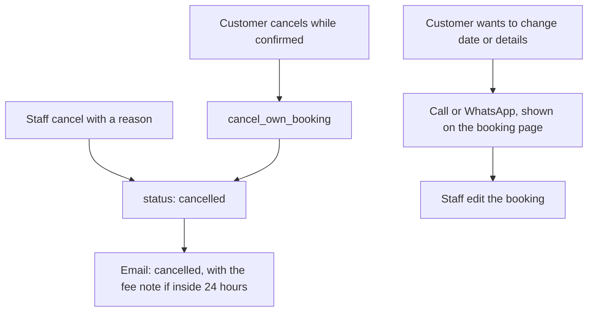

# True To Detail workflows

Every path a booking, customer, detailer or member of staff can take through
the website (truetodetail.co.uk) and the portal (app.truetodetail.co.uk),
what happens at each step, and which emails go out. Diagrams are Mermaid and
render on GitHub.

Statuses of a booking: `requested` (website enquiry, waiting for staff),
`confirmed`, `assigned`, `en_route`, `arrived`, `check_in`, `in_progress`,
`qc`, `handover`, `completed`, `cancelled`.

## 1. Booking arrives, from any of four doors

Today: the website and the quick-book popup email but store nothing, so
staff cannot see them in the portal. Portal and staff bookings send no email.

## 2. Staff handle a request

## 3. The job on the day (detailer link, no login)

## 4. The customer follows their booking

## 5. Accounts and access

Access rules (enforced in the database, not the browser):
- A customer can read and create only their own bookings, cars and addresses.
- Staff can read and change everything.
- A detailer link works only for that detailer's assigned jobs.
- The tracking link shows one booking and nothing else.
- Customers cannot set a price, package, status or detailer on a booking they create.

## 6. Cancel and change

## Emails

| When | To | Sent by |
| --- | --- | --- |
| Website request received | customer, staff | website API |
| Booked in (portal, staff or after confirming a request) | customer | website email service, called by the portal |
| Detailer on the way | customer | same |
| Job complete | customer | same |
| Cancelled or declined | customer | same |
| Account confirmation, password reset | the person | Supabase Auth |

Each email is logged per booking and kind, so a retry, a double click or a
refresh can never send it twice.

## Owner settings these flows depend on

- Supabase Auth: Site URL `https://app.truetodetail.co.uk`, redirect URLs for
  `/account`, `/account/reset` and `/t/*`, and a custom SMTP sender. The
  built-in sender only delivers to your own team's addresses, so confirmation
  and reset emails to customers will not arrive without one.
- Website (Vercel): `RESEND_API_KEY`, `BOOKING_FROM_EMAIL`,
  `NEXT_PUBLIC_SUPABASE_URL`, `NEXT_PUBLIC_SUPABASE_ANON_KEY`,
  `NEXT_PUBLIC_APP_URL`.
